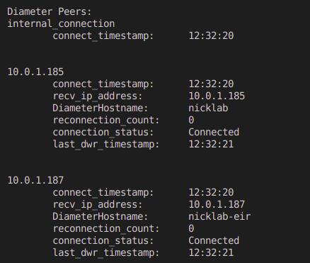

## PyHSS Monitoring

PyHSS's statistics & monitoring rely on [Redis](https://redis.io/).

### Viewing Diameter Peers
You can view all the current Diameter peers by running the ``view_stats.py`` tool, which will list all active and inactive Diameter peers connected / connected then disconnected from the system.




Different parts of the software have a code snippet like this:
```
        if yaml_config['redis']['enabled'] == True:
            try:
                self.redis_store.incr('Answer_257_attempt_count')
            except:
                logging.error("failed to incriment Answer_257_attempt_count")
```
Which checks to see if Redis is enabled in the config (Example config with Redis enabled at the bottom of this doc), and then attempts to incriment the value of a particular key.

This data can then be read by external Redis clients.

One such example is the ``view_stats.py`` tool which simply loops through and prints out the values from Redis.

For integrating into NMS systems we also expose the Redis statistics via SNMP using the [SNMP Labs PySNMP](https://github.com/etingof/pysnmp).

More info on the design descision to use Redis and PySNMP to expose this information is covered [in this blog post](https://nickvsnetworking.com/adding-snmp-to-anything-with-redis-and-python/).

OIDs are a bit of a problem, as SNMP's OIDs are numerical and our Redis keys are strings. To get around this a very rudimentary solution has been put together in the form of ``MIB_generator.py`` which loops through the keys defined in the code and assigns an OID to each.

If you wanted to do away with SNMP alltogether (and I woudln't blame you) and instead use Grafana or something similar, the data can easily be scraped from Redis as required.
